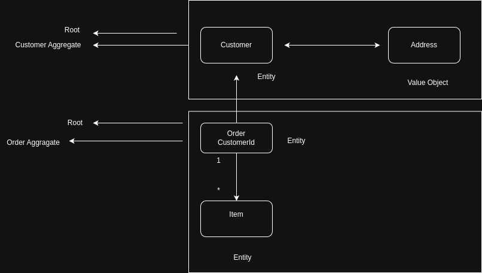

# Full Cycle 3.0

## DDD: Modelagem Tática e Patterns

### Elementos Táticos

- Quando estamos falando sobre DDD e precisamos olhar mais a hundo um Bounded Context.
- Precisamos ser capazes de ,odlarmos de forma mais assertive nos seus principais
  components, comportamento e individualidades, bem como seus relações.

### Entities

- Uma entidade é algo único que é capaz de forma contínua durante um longo período de tempo.

- Uma entidae é algo que possui uma continuidade em seu ciclo de vida e
  pode ser distinguida independete dos atributos que são importantes para a aplicação do usuário.
  Pode ser uma pessoa, cidade, carro, um ticket de loteria ou uma transação bancária.

Domain

- Entities
  - customer.ts (regra de negócio)

Infra - mundo externo

- Entities / Models
  - customer.ts (get, set)

### Value Objects

- Quando você se preocupa apneas com os atributos de um elemento de um
  model, classique-o como um Value Object.

- Trate o Value Object como um objeto imutável, ou seja, uma vez que ele é criado, ele não pode ser alterado.

Address:

- street
- city
- state
- zipCode

# Aggregates

- Um Agregado é um conjunto de objetos associados que tratamos
  como uma unidade para o propósito de mudança de dados.

  

# Domain Services
- Um serviço de domínio é uma operação que cumpre uma tarefa
 específica do domínio. Muitas vezes, a melhor indicação de que você deve
 criar um serviço no modelo de domínio é quando a operação que você
 precisa executar parace não se encixar como um método de um Agregador
 (10) ou um Objeto de Valor (6).

- Quando um processo ou transformação significativa no domínio não for uma
responsabilidade natural da **entidade** ou **objeto de valor**, adicione
uma operação ao modelo como uma interface autonôma declarada como um
**serviço**. Define a interface baseada na linguagem do modelo de domínio e 
certifique-se de que o nome da operação façá parte do **obiquitous language**.
Torne o **serviço** sem estado.

- Uma entidade pode realizar uma ação que vai afetar todas as entidades?
- Como realizar uma operação em lote?

- Cuidados:
  - Quando houver muitos Domain Services em seu projeto, **talvez**, isso pode
  indicar que seus agragados estão anêmicos.
  - Domain Services são Stateless

# Repositories

- Um repositório comumente se refere a um local de armazenamento, geralmente
considerado um local de seguirança ou preservação dos itens nele armazenados.
Quando você armazena algo em um repositório e repois retorna para recuperá-
lo, você espera que ele **esteja no mesmo estado que estava quando você o 
colocou lá**. Em algum momento, você pode optar por remover item armazenado do repositório.

- Esses objetos semelhantes a coleções são persistência. Todo tipo
**Agregado** persistente terá um **Repositório**. De um modo geral, existe uma
releção **um-parta-um um tipo agragado e um Repositório**.

# Domain events

- Use o evento de dominio para capturar uma ocorrência de algo que aconteceu no domínio.

- A essência de um evento de domínio é que você o sua para capturar coisas que
podem desencadear uma mudança no estado do aplicativo que você está
desenvolvendo. Esses objetos de evento são processados para causar
alterações no sistema e armazenados para fornecer um AuditLog.

- Todo evento deve ser representando em uma ação realizado no passado.
  - UserCreated
  - OrderPlaced
  - EmailSent

## Domain events - Quando usar:
- Normalmente um Domain Event deve ser utilizado quando queremos utilizar
  outros Bounded Contexts de uma mudança de estado.

## Domain events - Components

- Event
- Handler: Executa o processamento quando um evento é chamado
- Event Dispatcher: Responsável por armazenar e executar os handlers de um
evento quando ele for disparado.

## Domain events - Dinâmica
- Criar um 'Event Dispatcher'
- Criar um 'Evento'
- Criar um 'Handler' para o 'Evento'
- Registrar o Evento, juntamente com o Handler no 'Event Dispatcher'

Agora para disparar um evento, basta executar o método 'notify' do 'Event Dispatcher'.
Nesse momento todos os Handlers registrados no evento serão executados.

## Módulos

Em um contexto DDD, Módulos em seu modelo servem como contêineres
nomeados para classes de objetos de domínio que são altamente coesas 
entre si. O objeto deve ser baixo acoplamento entre as classes que estão em Módulos 
diferentes. Como os Módulos usados no DDD não são compartimentos
de armazenamentos an^rmicos ou genéricos, também é importante nomear 
adequedamentos os Módulos.

- Respeitar a linguagem Universal
- Baixo acoplamento
- Um ou mais agregados devem estar juntos somente se fazem sentido
- Organizado pelo domínio/subdomínio e não pelo tipo de objetos
- Devem respeitar a mesma divisão quando estão em camadas diferentes